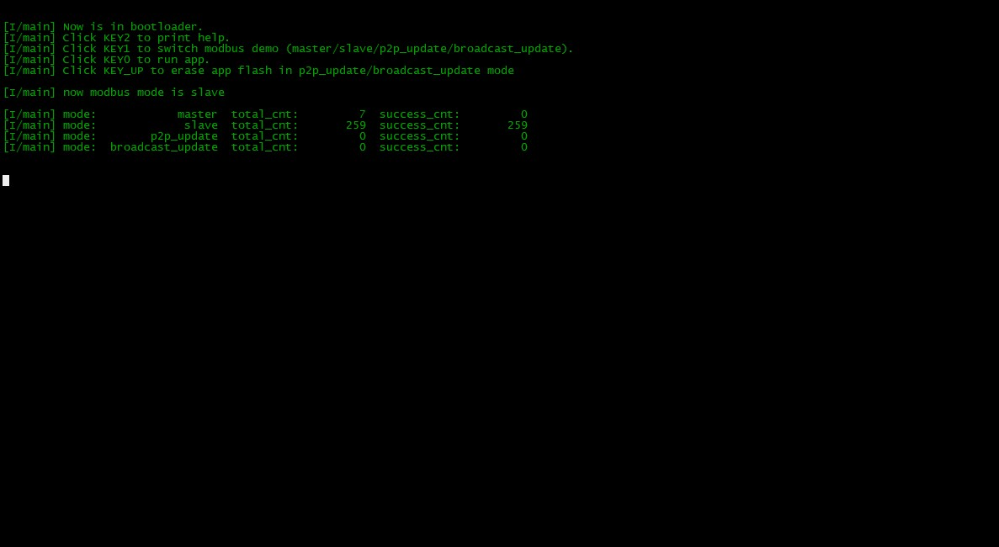

# Agile Modbus MCU Demos

## 1、介绍

1. 该仓库为轻量级协议栈 [Agile Modbus](https://github.com/loogg/agile_modbus) 在 MCU 上的例子。
2. 提供 `裸机`、`RT-Thread` 示例。
3. 提供简单 `RTU` 主机、从机示例。
4. 提供 `RTU` 固件升级示例，通过 [Agile Modbus](https://github.com/loogg/agile_modbus) 的 `p2p_master` 和 `broadcast_master` 特殊功能码示例实现 `点对点` 和 `快速数据流广播升级固件`。
5. 基于正点原子探索者开发板

  

- 目录结构

  | 名称 | 说明 |
  | ---- | ---- |
  | bootloader_nos | bootloader 裸机示例 |
  | bootloader_rtt | bootloader RT-Thread 示例 |
  | app | APP 应用程序 |

- 所有示例都是实现在 `bootloader` 中。

- `APP` 应用程序是由 `RT-Thread` 的开发板支持包下 `正点原子探索者 bsp` 编译出来的，只提供 HEX。

- 按键功能

  | 按键 | 说明 |
  | ---- | ---- |
  | KEY2 | 打印帮助信息 |
  | KEY1 | 切换 modbus demo (master/slave/p2p_update/broadcast_update) |
  | KEY0 | 运行应用程序 |

## 2、使用

- 下载 `裸机`、`RT-Thread` 示例中的任一个。

**注意**：由于板子有一键下载电路，所以需要先运行程序再打开终端，不然程序不运行。

- 单击 `KEY2` 打印帮助信息

  

### 2.1、主机示例

- 使用 `USB 转 RS485` 将电脑与开发板的 `RS485` 接口相连接

- 打开 `Modbus Slave`，设置如下

  

  

- 使用 `KEY1` 切换 `modbus` 示例为主机

  
