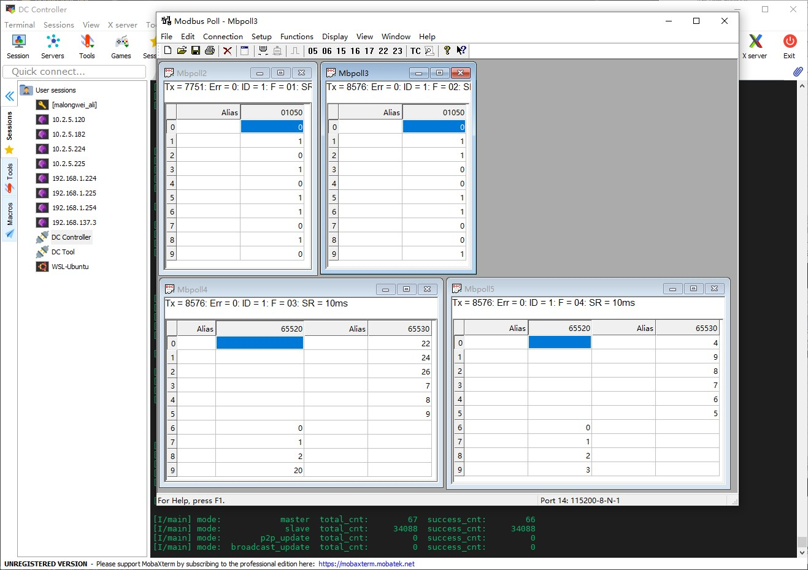

# Agile Modbus MCU Demos

## 1、介绍

1. 该仓库为轻量级协议栈 [Agile Modbus](https://github.com/loogg/agile_modbus) 在 MCU 上的例子。
2. 提供 `裸机`、`RT-Thread` 示例。
3. 提供简单 `RTU` 主机、从机示例。
4. 提供 `RTU` 固件升级示例，通过 [Agile Modbus](https://github.com/loogg/agile_modbus) 的 `p2p_master` 和 `broadcast_master` 特殊功能码示例实现 `点对点` 和 `快速数据流广播升级固件`。
5. 通过按键切换不同的示例
6. 基于正点原子探索者开发板

  

- 目录结构

  | 名称 | 说明 |
  | ---- | ---- |
  | bootloader_nos | bootloader 裸机示例 |
  | figures | 素材 |
  | bootloader_rtt | bootloader RT-Thread 示例 (开发中) |
  | update_tool | 固件升级示例使用工具和应用程序执行文件 |

- 所有示例都是实现在 `bootloader` 中。

- `APP` 应用程序是由 `RT-Thread` 的开发板支持包下 `正点原子探索者 bsp` 编译出来的，只提供 `bin`。

  - `APP` 运行地址为 `0x08008000`

  - `APP` 的 程序空间最大为 `0xF8000`

- 通过下面的宏定义开关可以决定编译哪些示例 (在 common.h)

  ```C

  #define MODBUS_MASTER_ENABLE           1
  #define MODBUS_SLAVE_ENABLE            1
  #define MODBUS_P2P_UPDATE_ENABLE       1
  #define MODBUS_BROADCAST_UPDATE_ENABLE 1

  ```

- 资源占用

  - 只编译 `Master`

    

  - 只编译 `Slave`

    

  - 只编译 `p2p_update`

    

  - 只编译 `broadcast_update`

    

  - 编译全部示例

    

- 按键功能

  | 按键 | 说明 |
  | ---- | ---- |
  | KEY2 | 打印帮助信息 |
  | KEY1 | 切换 modbus demo (master/slave/p2p_update/broadcast_update) |
  | KEY0 | 运行应用程序 |
  | KEY_UP | 在 p2p_update/broadcast_update 示例中擦除 app 固件flash |

## 2、使用

- 下载 `裸机`、`RT-Thread` 示例中的任一个。

  **注意**：由于板子有一键下载电路，使用终端软件复位板子会造成程序不运行的现象，提供两个方法。

  - 使用 `SecureCRT` 终端软件，将 `DTR Flow Control` 和 `RTS Flow Control` 值设置为 0。

    具体方法参照 <https://club.rt-thread.org/ask/question/8413.html>。

  - 使用串口调试助手，但是会没有颜色信息。

  - 不使用板子上的 `MiniUSB` 调试口，使用 `USB 转 TTL` 直接接到 `PA9`、`PA10`、`GND` 脚。

- 使用 `USB 转 RS485` 将电脑与开发板的 `RS485` 接口相连接

- 单击 `KEY2` 打印帮助信息

  终端会列出每个示例下 `总操作次数` 和 `成功操作次数`。但切换示例会导致目标示例的这两个信息清零。

  

### 2.1、主机示例

- 打开 `Modbus Slave`，设置如下

  

  

- 使用 `KEY1` 切换 `modbus` 示例为主机

  

### 2.2、从机示例

- 打开 `Modbus Poll`，设置如下

  

  

- 使用 `KEY1` 切换 `modbus` 示例为从机

  

### 2.3、升级固件

使用 `0x50` 作为传输文件的特殊功能码。

分包传输文件数据，每包数据最大 1024 字节。

`Data` 字段协议定义：

- 主机请求

  | 命令 | 字节数 | 数据 |
  | ---- | ---- | ---- |
  | 2 Bytes | 2 Bytes | N Bytes |

  命令:

  | 命令 | 说明 | 数据 |
  | ---- | ---- | ---- |
  | 0x0001 | 开始发送 | 文件大小(4 Bytes) + 文件名称(字符串) |
  | 0x0002 | 传输数据 | 标志(1 Byte) + 文件数据 |

  标志:

  | 状态 | 说明 |
  | ---- | ---- |
  | 0x00 | 最后一包数据 |
  | 0x01 | 不是最后一包数据 |

- 从机响应

  | 命令 | 状态 |
  | ---- | ---- |
  | 2 Bytes | 1 Byte |

  状态:

  | 状态 | 说明 |
  | ---- | ---- |
  | 0x00 | 失败 |
  | 0x01 | 成功 |

#### 2.3.1、点对点(应答)

- 使用 `KEY_UP` 擦除 `APP` 程序空间

- 使用 `KEY1` 切换示例为 `p2p_update`

- 在 `WSL` 或 `Linux` 环境下运行 `update_tool` 文件夹下的 `p2p_master`

- 升级完成后使用 `KEY0` 运行 `APP`


#### 2.3.2、广播传输(快速数据流 + 脏数据)

`broadcast_master` 中，使用广播地址 0，周期 5ms 发送数据包。同时每包数据后都发送 100 字节的脏数据。

- 使用 `KEY_UP` 擦除 `APP` 程序空间

- 使用 `KEY1` 切换示例为 `broadcast_update`

- 在 `WSL` 或 `Linux` 环境下运行 `update_tool` 文件夹下的 `broadcast_master`

- 升级完成后使用 `KEY0` 运行 `APP`


