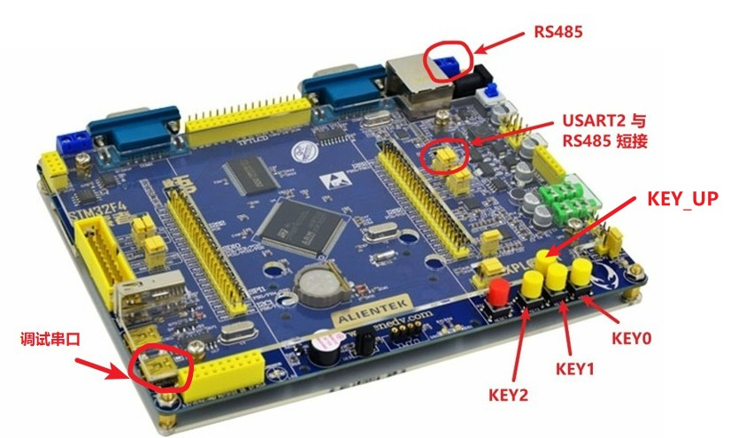

# Agile Modbus MCU Demos

## 1、介绍

1. 该仓库为轻量级协议栈 [Agile Modbus](https://github.com/loogg/agile_modbus) 在 MCU 上的例子。
2. 提供 `裸机`、`RT-Thread` 示例。
3. 提供简单 `RTU` 主机示例。
4. 提供 `RTU` 从机，通过 [Agile Modbus](https://github.com/loogg/agile_modbus) 的 `p2p_master` 和 `broadcast_master` 特殊功能码示例实现 `点对点` 和 `快速数据流广播升级固件`。
5. 基于正点原子探索者开发板

目录结构

| 名称 | 说明 |
| ---- | ---- |
| bootloader_nos | bootloader 裸机示例 |
| bootloader_rtt | bootloader RT-Thread 示例 |
| app | APP 应用程序 |

## 2、使用

### 2.1、bootloader 使用

- 下载程序运行，终端打印信息如下图：

  **注意**：由于板子有一键下载电路，所以需要先运行程序再打开终端，不然程序不运行。为了能够看到打印的日志，在程序里加了 2s 延时。

  

- 按下 `KEY0`，运行 `app1`

- 按下 `KEY1`，运行 `app2`
